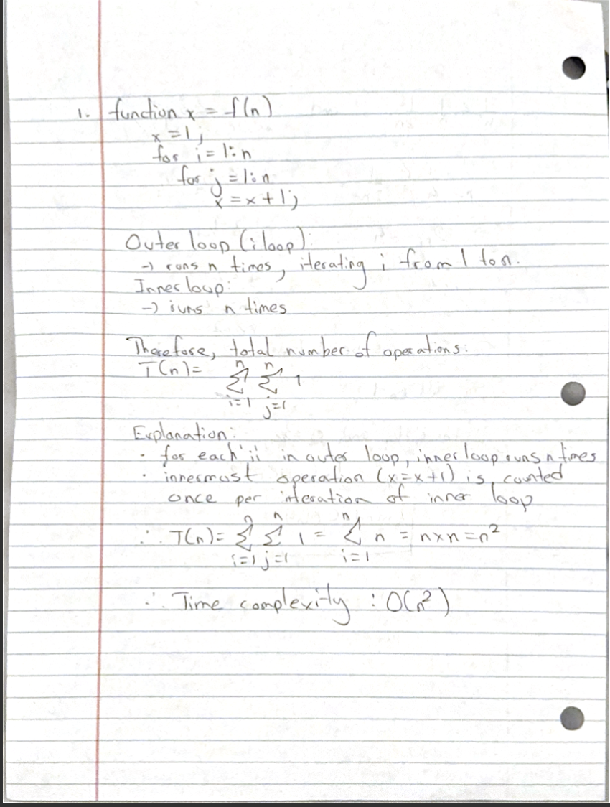
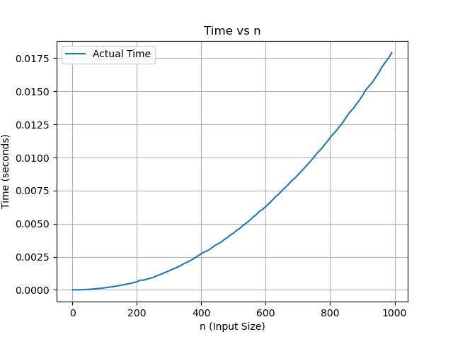
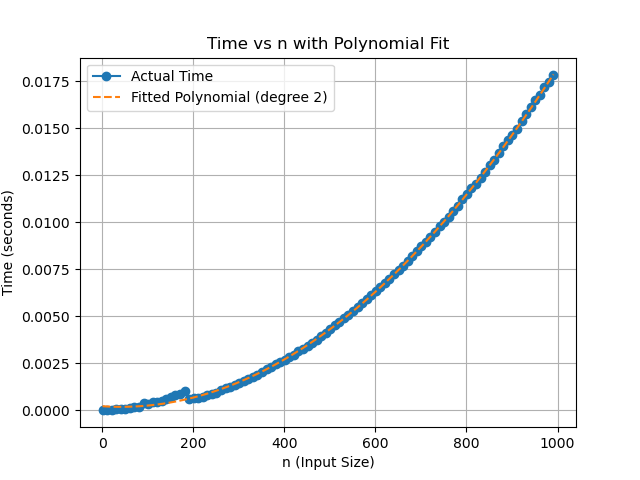

```markdown

# README

## Problem Description

This repo addresses several questions and tasks related to algorithmic complexity, function timing, curve fitting, and sorting algorithms.
---

### Questions and Answers

---

### 1. Find the runtime of the algorithm mathematically (I should see summations).

**Given function:**

```matlab

function x = f(n)

   x = 1;

   for i = 1:n

        for j = 1:n

             x = x + 1;

```




The function consists of two nested loops, both running from 1 to \(n\). Each inner loop executes a constant time operation `x = x + 1`.

To determine the total number of operations, we calculate:

\[

T(n) = \sum_{i=1}^{n} \sum_{j=1}^{n} 1 = n \times n = n^2

\]

Thus, the time complexity of the function is \(O(n^2)\), meaning the function scales quadratically as \(n\) increases.

---

### 2. Time this function for various \(n\) (e.g., \(n = 1, 2, 3, \ldots\)). You should have small values of \(n\) all the way up to large values. Plot "time" vs "n" (time on y-axis and \(n\) on x-axis). Also, fit a curve to your data, hint it's a polynomial.

For this question, we:

- Time the function `f(n)` for various values of \(n\).

- Measure how long it takes to run the function for each value of \(n\).

- Plot the runtime against \(n\) on a graph with \(n\) on the x-axis and time on the y-axis.

- Fit a polynomial curve (hint: quadratic) to the data, as we expect the time complexity to follow a quadratic pattern.

**Time vs \(n\) plot:**



---

### 3. Find polynomials that are upper and lower bounds on your curve from #2. From this specify a Big-O, Big-Omega, and what Big-Theta is.

Based on the results of the timing and curve fitting, we analyze the upper and lower bounds:

- **Big-O (Upper Bound):** The time complexity of the function is \(O(n^2)\), meaning the number of operations grows quadratically with \(n\).

- **Big-Omega (Lower Bound):** The minimum number of operations also grows as \(n^2\), so the function is \(\Omega(n^2)\).

- **Big-Theta (Tight Bound):** Since the upper and lower bounds match, the time complexity of the function is \(\Theta(n^2)\).

Thus, the function's runtime is tightly bounded by \(n^2\).

---

### 4. Find the approximate (eyeball it) location of "n_0". Do this by zooming in on your plot and indicating on the plot where \(n_0\) is and why you picked this value. Hint: I should see data that does not follow the trend of the polynomial you determined in #2.

To find \(n_0\), where the function's behavior starts to deviate from the fitted polynomial curve:

- Zoom in on the plot and examine the values of \(n\) where the performance curve diverges from the expected quadratic growth.

- \(n_0\) is the approximate point at which system-related factors (like memory limitations) cause the function to deviate from the ideal quadratic trend.

**Quadratic fit with \(n_0\) marked:**



---

### 5. If I modified the function to be:

```matlab

function [x, y] = f(n)

   x = 1;

   y = 1;

   for i = 1:n

        for j = 1:n

             x = x + 1;

             y = i + j;

```

#### 5.1. Will this increase how long it takes the algorithm to run (e.g., you are timing the function like in #2)?

Yes the modified function adds an extra operation `y = i + j` within the inner loop. This will increase the runtime slightly. However, this operation is still \(O(1)\) (constant TC), so the overall time complexity remains \(O(n^2)\), though the function will take just slightly longer to run.

#### 5.2. Will it affect your results from #1?

No. The additional operation does not affect the fundamental analysis of the time complexity. The inner loop still executes \(n^2\) times so the overall time complexity remains O(n^2)\.

---

### 6. Implement merge sort, upload your code to GitHub, and show/test it on the array `[5, 2, 4, 7, 1, 3, 2, 6]`.

Implemented in mergeSort.py.

Thank you.
